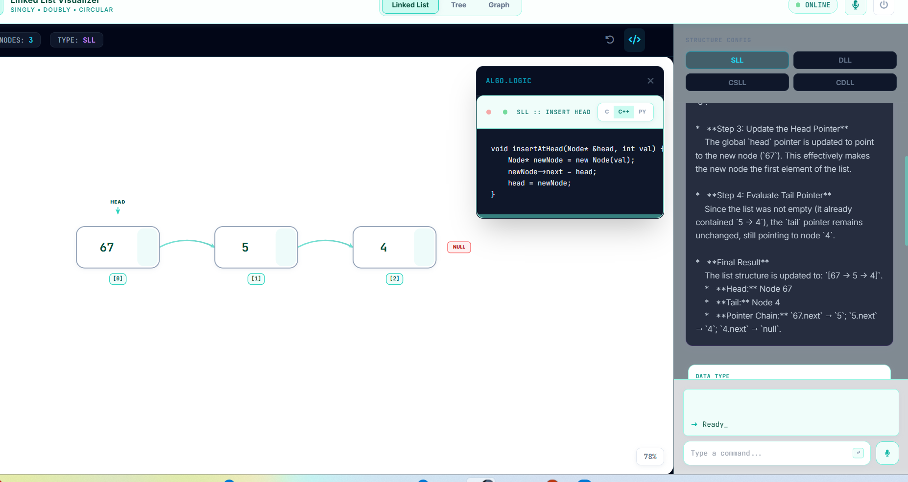
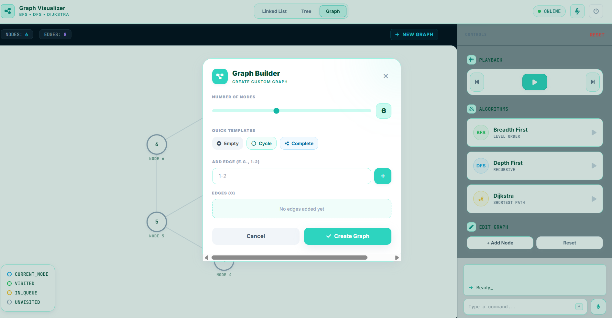
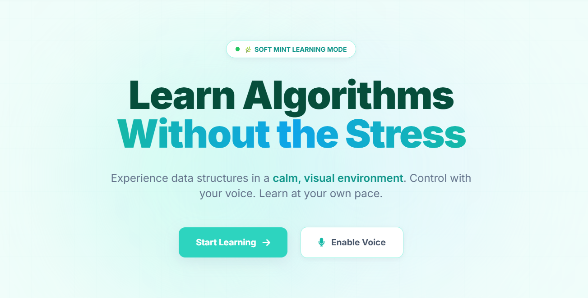
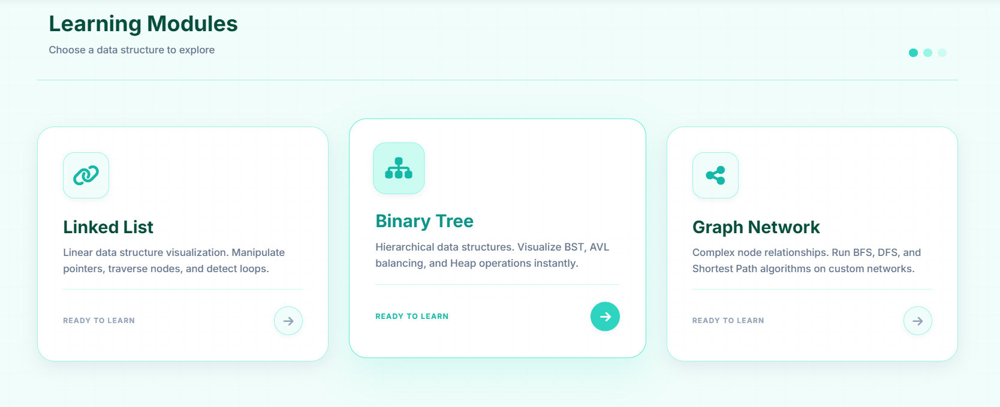

<div align="center">

</div>

# DSA Vision - Interactive Data Structures Visualizer

A voice-controlled, AI-powered data structure visualizer for Linked Lists, Trees, and Graphs.

## 🚀 Quick Start

**Prerequisites:** Node.js

```bash
npm install
npm run dev
```

Set your Gemini API key in `.env.local`:
```
VITE_GEMINI_API_KEY=your_api_key_here
```

---

## 🎙️ Voice Control

### How to Use
1. Click the **microphone button** (bottom-right)
2. Speak your command clearly
3. Watch the AI process and execute
4. Listen to voice feedback

### Supported Commands

#### Linked List
| Say This | Action |
|----------|--------|
| "insert 5" / "add 5" | Insert at tail |
| "insert 5 at head" | Insert at head |
| "delete 5" / "remove 5" | Delete value 5 |
| "search for 5" / "find 5" | Search for value |
| "reverse the list" | Reverse list |
| "sort the list" | Sort ascending |
| "clear the list" | Clear all nodes |

#### Trees
| Say This | Action |
|----------|--------|
| "insert 30" | Insert into tree |
| "delete 15" | Remove value 15 |
| "inorder traversal" | Perform inorder |
| "preorder traversal" | Perform preorder |
| "find minimum" | Find min value |
| "find maximum" | Find max value |

#### Graphs
| Say This | Action |
|----------|--------|
| "start BFS" | Run Breadth First Search |
| "start DFS" | Run Depth First Search |
| "start Dijkstra" | Run Dijkstra's algorithm |
| "add edge 1 to 3" | Add edge between nodes |
| "reset graph" | Reset to initial state |

---

## 📸 Screenshots

### Hero Page
Experience data structures in a calm, visual environment. Control with your voice and learn at your own pace.


### Learning Modules
Choose a data structure to explore: Linked Lists, Binary Trees, and Graph Networks.


### Linked List Visualizer
Visualize and manipulate singly, doubly, and circular linked lists with step-by-step algorithm explanations and code display.


### Graph Visualizer
Create custom graphs and run BFS, DFS, and Dijkstra algorithms with real-time visualization of node traversal.


---

## 🧠 AI Features

- **Gemini AI Intent Parsing** - Natural language understanding for flexible commands
- **Voice Feedback** - Speaks operation results with list/tree state
- **Algorithm Explanations** - AI-generated step explanations and complexity analysis

---

## 📁 Project Structure

```
dsavoice/
├── routes/
│   ├── linked-list/     # Linked List visualizer
│   ├── tree/            # Tree visualizer (BST, AVL, Heap)
│   └── graph/           # Graph visualizer (BFS, DFS, Dijkstra)
├── services/
│   ├── voiceControl.ts  # Voice recognition & intent parsing
│   ├── gemini.ts        # Gemini AI integration
│   └── *Operations.ts   # Data structure operations
└── components/          # Shared UI components
```

---

## 🔊 Voice Feedback Examples

**Insert:** "Inserted 5 at tail. List now contains: 1, 3, 5"

**Delete:** "Deleted node with value 3. Remaining nodes: 1, 5"

**Sort:** "List sorted. Sorted output is: 1, 5, 8"

**Graph:** "Starting Dijkstra's algorithm. This finds the shortest path from the source node to all other nodes."

---

## 🌐 Browser Support

| Browser | Support |
|---------|---------|
| Chrome/Edge | ✅ Full support (Recommended) |
| Safari | ✅ Supported |
| Firefox | ❌ Limited speech recognition |

---

## 🔧 Troubleshooting

| Issue | Solution |
|-------|----------|
| Speech not working | Use Chrome/Edge, allow microphone access |
| Commands not understood | Speak clearly, include numbers explicitly |
| AI processing failed | Check `.env.local` API key, check internet |
| Mic not responding | Grant browser permissions, close other apps using mic |

---

## 🛠️ Development

View app in AI Studio: https://ai.studio/apps/drive/1bwbR_0pMPg26zpY0EwtAtI8iEJvRxU11

**Tech Stack:** React, TypeScript, Tailwind CSS, Google Gemini AI

---

**Enjoy hands-free data structure visualization! 🎉**
